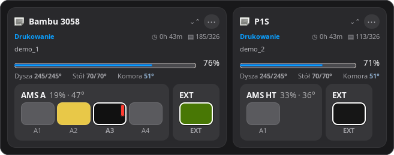

<div align="center">


# Gantry

A local, cross-platform monitor for your 3D printer fleet.

Watch every printer from the menu bar, the system tray or the panel:
live state, progress, layers, temperatures, filament and notifications.

[](https://github.com/parametryczny/gantrybar/actions/workflows/ci.yml)
[](https://github.com/parametryczny/gantrybar/releases/latest)
[](LICENSE)
[](#downloads--pobieranie)
[](https://github.com/parametryczny/gantrybar/releases)

**[English](#english)** · **[Polski](#polski)**

</div>


Gantry watches **Bambu Lab, Anycubic Kobra S1, Elegoo Centauri Carbon, Klipper/Moonraker, Prusa (PrusaLink) and Snapmaker** printers over your own network. No account, no cloud, no middleman server.

*Gantry obserwuje drukarki **Bambu Lab, Anycubic Kobra S1, Elegoo Centauri Carbon, Klipper/Moonraker, Prusa (PrusaLink) i Snapmaker** po Twojej własnej sieci. Bez konta, bez chmury, bez serwera pośredniczącego.*

---

## Downloads / Pobieranie

Grab the latest build from the **[Releases page](https://github.com/parametryczny/gantrybar/releases/latest)** / Pobierz najnowszy build ze **[strony wydań](https://github.com/parametryczny/gantrybar/releases/latest)**:

- **macOS** — `Gantry-*-macOS.dmg` (drag‑to‑Applications installer / instalator przeciągnij‑do‑Programów)
- **Windows x64** — `Gantry-Setup-Windows-x64.exe` (installer / instalator, zalecany) or portable `Gantry-Windows-x64.zip`
- **GNU/Linux** — packages in preparation: `.deb` / `.rpm` for classic system installation and a portable `.AppImage` containing the app and most required libraries (beta, GTK) / pakiety w przygotowaniu: `.deb` / `.rpm` do klasycznej instalacji systemowej oraz przenośny `.AppImage` z aplikacją i większością potrzebnych bibliotek

Neither Windows download needs a separate .NET install. On macOS the app is self‑signed, so on first launch open it with right‑click → **Open**. / Żaden wariant Windows nie wymaga osobnej instalacji .NET. Na macOS aplikacja jest podpisana lokalnie — przy pierwszym uruchomieniu otwórz ją PPM → **Otwórz**.

---

## English

A compact, MIT‑licensed monitor named **Gantry**. It discovers Bambu printers on the local network, connects to Anycubic/Klipper/Prusa/Snapmaker by address, and lays out larger fleets in an adaptive “bento” dashboard.

### Supported printers

| Type | Protocol | Notes |
|------|----------|-------|
| **Bambu Lab** | MQTT/TLS (local) | full AMS / AMS HT / external, dual‑nozzle (H2D/X2D), HMS errors — no Bambu Cloud account |
| **Anycubic Kobra S1** | MQTT/TLS (LAN mode) | status, temperatures, print controls, chamber light, ACE Pro and FLV camera on port 18088; no Anycubic Cloud account |
| **Elegoo Centauri Carbon** | SDCP/WebSocket (local) | CC1 on port 3030, MJPEG camera on 3031; no access code |
| **Elegoo Centauri Carbon 2** | MQTT (LAN-only) | CC2 on port 1883, Canvas A1–A4 and MJPEG camera on 8080; printer access code required |
| **Klipper / Moonraker** | Moonraker HTTP | Happy Hare MMU and Creality CFS auto‑detected; also covers Qidi, Creality K1/K2, Snapmaker **U1** |
| **Prusa** | PrusaLink HTTP | local IP + API key, no Prusa account |
| **Snapmaker** | HTTP (port 8080) | Snapmaker **2.0 / Artisan**; authorize on the printer touchscreen after adding |

### Features

- **One dashboard for the whole fleet** — print state, progress, ETA, layers and temperatures (nozzle/bed/chamber, dual‑nozzle L/R) on macOS‑style cards
- **Filament at a glance** — AMS, AMS HT, Creality CFS, Happy Hare MMU and external spools with slot colours, humidity, and active / low‑filament highlighting
- **Spoolbase** — a built‑in filament inventory (catalog of 1150+ spools): grouped by type, colour‑coded stock badges, add/edit/delete, quick spool‑count changes and search, plus **physical spools** (grams) assigned to AMS/EXT with auto‑decrement after a print. Guide: **[docs/spoolbase.md](docs/spoolbase.md)**
- **Printer details view** — an in‑panel detail screen (open with the **Details** button, with a Back button — no extra window) showing a live temperature graph, fans, speed and nozzle diameter, the full AMS/filament layout and a **live camera**; reorder its cards by drag‑and‑drop
- **Live camera** — Bambu chamber camera over **RTSPS/RTSP**, Anycubic Kobra S1 over FLV and Elegoo/Klipper/Creality webcams via MJPEG, with a mode/resolution badge
- **Automations & control** (developer mode) — Gantry can send commands (chamber light, pause/resume/stop) and run per‑printer rules: a trigger (manual / layer ≥ N / progress ≥ % / state change) → an action (LED, pause/resume/stop, notification, a custom MQTT/G‑code command, or a **script** — paste Python via `#!` shebang). See **[docs/automations.md](docs/automations.md)**
- **Per‑printer advanced overrides** — an optional separate camera IP, custom light‑on/off commands, and Moonraker object‑name overrides for non‑standard Klipper setups
- **Automatic updates** (macOS + Windows) — a dedicated Updates card in Settings with an auto‑download/install toggle; the download is verified (code signature on macOS, SHA‑256 on Windows) and installs silently
- **Notifications** — print finished, printer error, paused, low filament, high AMS humidity — with quiet hours
- **Looks native** — light/dark theme, adjustable panel transparency, Polish and English
- **Secure by default** — access codes/API keys in the macOS Keychain, Windows DPAPI or Linux Secret Service; local‑only, no cloud; TLS certificate pinning after the first trusted connection
- **Finds printers for you** — Bambu discovery via SSDP multicast plus a unicast subnet scan (a VPN like Tailscale carries no multicast, so add its IP/CIDR/range as an extra scan target)
- Persistent drag‑and‑drop card ordering, a compact one‑line mode for four or more printers, automatic reconnect and address refresh

<p align="center">
  
</p>

### Telegram: your fleet in your pocket


Print alerts reach your phone and the bot answers back. `/status` picks a printer and gives you its
job, progress, layers, ETA, temperatures, AMS humidity and loaded slots, plus buttons for pause,
resume, stop, chamber light and a camera photo. `/all` summarises the fleet, `/spools` lists rolls
running low, `/history` the recent prints, `/watch 10m` sends a photo on a timer and `/mute 2h`
silences alerts.

**The bridge is your own computer.** There is no Gantry server: you create your **own bot** with
BotFather and paste the token into Settings, where it stays. The bot replies only to your configured
chat. A sleeping laptop means a silent bot, and everything resumes by itself once it wakes.
Step by step: **[docs/telegram-setup.md](docs/telegram-setup.md)**.

### Edge panel: always on top, never in the way


A strip 22 points wide, pinned to the left or right edge of the screen, carrying one progress ring
per printer. At rest it shows only the status colour and how full each ring is. Hovering unfolds it
into names, percentages and remaining time; clicking a row opens that printer's details. It rides
above other windows and across every desktop, and a click never steals focus from what you are
typing in. **Off by default**, because it is a second surface next to the popover, not a replacement.

One caveat on GNU/Linux: **Wayland has no protocol for keeping a window on top**. It works normally
on X11 and on wlroots compositors (Sway, Hyprland); under GNOME's Wayland session another window can
cover the strip.

### Requirements

- macOS 26 or newer, 64‑bit Windows 10/11, or a Debian/Ubuntu‑family desktop for the Linux beta
- the computer and the printers on the same local network, LAN access enabled on each printer
- for Bambu: the serial number and Access Code/PIN; for Anycubic Kobra S1: IP + LAN mode; for Elegoo CC1: IP + MainboardID; for Elegoo CC2: IP + serial + access code and LAN-only mode; for Prusa: the PrusaLink API key
- to build from source: Swift 6 + Xcode Command Line Tools (macOS), .NET 8 SDK (Windows), or Python 3.10 + GTK 3 + Ayatana AppIndicator (Linux)

### Adding printers

Click the Gantry icon, then `+`, and pick the printer type:

- **Bambu** — choose a device from **Detected** (or import from Bambu Studio), enter the Access Code/PIN and click **Add**. Import matches discovered printers with codes already stored in the local Bambu Studio configuration.
- **Anycubic** — select **Kobra S1**, enable LAN mode on the printer and enter its IP. Gantry obtains the local MQTT session automatically; no account or access code is needed. Details: **[docs/anycubic-kobra-s1.md](docs/anycubic-kobra-s1.md)**.
- **Elegoo** — select **Centauri Carbon** or **Centauri Carbon 2**. CC1 needs no code. For CC2, first enable **LAN-only** on the printer and enter the access code shown by the printer. Details: **[docs/elegoo-centauri.md](docs/elegoo-centauri.md)**.
- **Klipper (Moonraker)** — enter the host IP and port (default 7125). No code needed.
- **Prusa (PrusaLink)** — enter the IP, port (default 80) and the API key from PrusaLink settings.
- **Snapmaker** — enter the IP (port 8080). After adding, tap **Allow** on the printer's touchscreen to authorize; re‑authorize after each power cycle.

### Build and run

```bash
git clone https://github.com/parametryczny/gantrybar.git
cd gantrybar
chmod +x scripts/build-app.sh scripts/build-dmg.sh
./scripts/build-app.sh local        # dist/Gantry.app
./scripts/build-dmg.sh              # dist/Gantry-<version>-macOS.dmg (drag‑to‑install)
```

See [windows/README.md](windows/README.md) for the Windows build (GitHub Actions produces a self‑contained `Gantry.exe` and an Inno Setup installer, no .NET runtime required on the target PC) and [linux/README.md](linux/README.md) for the GNU/Linux beta and its `.deb`, `.rpm` and `.AppImage` builds. On the first macOS launch, allow Local Network access when asked.

### Tests

```bash
swift build --disable-sandbox
.build/debug/Gantry --self-test
```

The self‑test covers SSDP parsing, MQTT framing, Unicode print names, telemetry and the AMS layouts. Run the Linux unit tests with `PYTHONPATH=linux python3 -m unittest discover -s linux/tests`.

### Privacy

Gantry reads printer status only from the local network and stores credentials in the OS secure store (Keychain / DPAPI / Secret Service). Bambu Studio configuration is read only after you choose **Import printers and codes**. See [SECURITY.md](SECURITY.md) for the local‑network trust model and vulnerability reporting.

### Project status

An early, community‑built project. The local printer protocols used here are not guaranteed to remain stable, so firmware changes may require updates to Gantry. Gantry is independent and is not affiliated with, endorsed by or sponsored by Bambu Lab, Anycubic, Elegoo, Prusa Research, Snapmaker or Creality; product names are trademarks of their respective owners.

---

## Polski

Kompaktowy monitor drukarek 3D na licencji MIT o nazwie **Gantry**. Wykrywa drukarki Bambu w sieci lokalnej, łączy się z Anycubic/Klipper/Prusa/Snapmaker po adresie i prezentuje większe floty na adaptacyjnym pulpicie „bento".

### Obsługiwane drukarki

| Typ | Protokół | Uwagi |
|-----|----------|-------|
| **Bambu Lab** | MQTT/TLS (lokalnie) | pełne AMS / AMS HT / zewnętrzny, dwie dysze (H2D/X2D), błędy HMS — bez konta Bambu Cloud |
| **Anycubic Kobra S1** | MQTT/TLS (tryb LAN) | stan, temperatury, sterowanie drukiem, światło komory, ACE Pro i kamera FLV na porcie 18088; bez konta Anycubic Cloud |
| **Elegoo Centauri Carbon** | SDCP/WebSocket (lokalnie) | CC1 na porcie 3030, kamera MJPEG na 3031; bez kodu dostępu |
| **Elegoo Centauri Carbon 2** | MQTT (LAN-only) | CC2 na porcie 1883, Canvas A1–A4 i kamera MJPEG na 8080; wymagany kod drukarki |
| **Klipper / Moonraker** | Moonraker HTTP | Happy Hare MMU i Creality CFS wykrywane automatycznie; obejmuje też Qidi, Creality K1/K2, Snapmaker **U1** |
| **Prusa** | PrusaLink HTTP | lokalne IP + klucz API, bez konta Prusy |
| **Snapmaker** | HTTP (port 8080) | Snapmaker **2.0 / Artisan**; po dodaniu zatwierdź na ekranie drukarki |

### Funkcje

- **Jeden pulpit dla całej floty** — stan druku, postęp, czas do końca, warstwy i temperatury (dysza/stół/komora, dwie dysze L/P) na kartach w stylu macOS
- **Filament na pierwszy rzut oka** — AMS, AMS HT, Creality CFS, Happy Hare MMU i szpule zewnętrzne z kolorami slotów, wilgotnością oraz wyróżnianiem aktywnego / kończącego się filamentu
- **Spoolbase** — wbudowany magazyn filamentów (katalog 1150+ szpul): grupowanie po typie, kolorowe plakietki stanu, dodawanie/edycja/usuwanie, szybka zmiana liczby szpul i wyszukiwarka, plus **fizyczne rolki** (gramy) przypisane do AMS/EXT z automatycznym odejmowaniem po wydruku. Poradnik: **[docs/spoolbase.md](docs/spoolbase.md)**
- **Widok „Szczegóły" drukarki** — ekran szczegółów **w obrębie panelu** (przycisk **Szczegóły**, z przyciskiem „Wróć" — bez osobnego okna): wykres temperatur w czasie, wentylatory, prędkość i średnica dyszy, pełny układ AMS/filamentów oraz **kamera na żywo**; kafle można przestawiać przeciągnij‑i‑upuść
- **Kamera na żywo** — kamera komory Bambu przez **RTSPS/RTSP**, Anycubic Kobra S1 przez FLV oraz kamery **Elegoo/Klipper/Creality** przez MJPEG, z plakietką trybu i rozdzielczości
- **Automatyzacje i sterowanie** (tryb deweloperski) — Gantry wysyła komendy (światło komory, pauza/wznów/stop) i uruchamia reguły per drukarka: wyzwalacz (ręcznie / warstwa ≥ N / postęp ≥ % / zmiana stanu) → akcja (LED, pauza/wznów/stop, powiadomienie, własna komenda MQTT/G‑code lub **skrypt** — czysty Python przez `#!` shebang). Zobacz **[docs/automations.md](docs/automations.md)**
- **Nadpisania per drukarka** — opcjonalne osobne IP kamery, własne komendy światła wł./wył. oraz nazwy obiektów Moonraker dla niestandardowych konfiguracji Klippera
- **Automatyczne aktualizacje** (macOS + Windows) — dedykowana karta w Ustawieniach z przełącznikiem auto; pobranie jest weryfikowane (podpis kodu na macOS, SHA‑256 na Windows) i instalowane po cichu
- **Powiadomienia** — koniec druku, błąd, pauza, niski filament, wysoka wilgotność AMS — z godzinami ciszy
- **Wygląda natywnie** — motyw jasny/ciemny, regulowana przezroczystość panelu, polski i angielski
- **Bezpieczne domyślnie** — kody dostępu / klucze API w pęku kluczy macOS, DPAPI Windows lub Secret Service na Linuksie; wyłącznie lokalnie, bez chmury; przypinanie certyfikatu TLS po pierwszym zaufanym połączeniu
- **Znajduje drukarki za Ciebie** — wykrywanie Bambu przez multicast SSDP i unicastowy skan podsieci (VPN jak Tailscale nie przenosi multicastu — dodaj jego IP/CIDR/zakres jako dodatkowy cel skanu)
- Trwałe porządkowanie kart przeciągnij‑i‑upuść, kompaktowy tryb jednoliniowy przy czterech i więcej drukarkach, automatyczne łączenie ponowne i odświeżanie adresów

### Telegram: flota w kieszeni


Alerty o wydrukach trafiają na telefon, a bot odpowiada. `/status` wybiera drukarkę i pokazuje
zadanie, postęp, warstwy, czas do końca, temperatury, wilgotność AMS i załadowane sloty, plus
przyciski pauzy, wznowienia, stopu, światła komory i zdjęcia z kamery. `/all` streszcza flotę,
`/spools` wypisuje kończące się rolki, `/history` ostatnie wydruki, `/watch 10m` wysyła zdjęcie
cyklicznie, a `/mute 2h` wycisza alerty.

**Mostkiem jest Twój komputer.** Nie ma serwera Gantry: zakładasz **własnego bota** u BotFather
i wklejasz token w Ustawieniach, gdzie zostaje. Bot odpowiada wyłącznie na skonfigurowany czat.
Uśpiony laptop oznacza milczącego bota, a po wybudzeniu wszystko wraca samo.
Krok po kroku: **[docs/telegram-setup.md](docs/telegram-setup.md)**.

### Panel krawędziowy: zawsze na wierzchu, nigdy na drodze


Pasek szeroki na 22 punkty, przyklejony do lewej albo prawej krawędzi ekranu, z jednym pierścieniem
postępu na drukarkę. W spoczynku niesie tylko kolor statusu i wypełnienie pierścienia. Najechanie
kursorem rozsuwa go do nazw, procentów i pozostałego czasu, a kliknięcie wiersza otwiera szczegóły
tej drukarki. Widać go nad innymi oknami i na każdym pulpicie, a kliknięcie nie zabiera fokusu temu,
w czym akurat piszesz. **Domyślnie wyłączony**, bo to druga powierzchnia obok popovera, a nie jego
zamiennik.

Jedno zastrzeżenie na GNU/Linuksie: **Wayland nie ma protokołu trzymania okna na wierzchu**.
Na X11 i na kompozytorach wlroots (Sway, Hyprland) działa normalnie; w sesji Wayland pod GNOME pasek
da się przykryć innym oknem.

### Wymagania

- macOS 26 lub nowszy, 64‑bitowy Windows 10/11 albo desktop z rodziny Debian/Ubuntu dla wersji beta
- komputer i drukarki w tej samej sieci lokalnej, włączony dostęp LAN na każdej drukarce
- Bambu: numer seryjny i kod dostępu; Anycubic Kobra S1: IP + tryb LAN; Elegoo CC1: IP + MainboardID; Elegoo CC2: IP + numer seryjny + kod i tryb LAN-only; Prusa: klucz API PrusaLink
- budowa ze źródeł: Swift 6 + Xcode CLT (macOS), .NET 8 SDK (Windows) albo Python 3.10 + GTK 3 + Ayatana AppIndicator (Linux)

### Dodawanie drukarek

Kliknij ikonę Gantry, potem `+`, i wybierz typ drukarki:

- **Bambu** — wybierz urządzenie z listy **Wykryte** (lub zaimportuj z Bambu Studio), wpisz kod dostępu i kliknij **Dodaj**. Import dopasowuje wykryte drukarki do kodów z lokalnej konfiguracji Bambu Studio.
- **Anycubic** — wybierz **Kobra S1**, włącz tryb LAN w drukarce i podaj jej IP. Gantry sam pobierze lokalną sesję MQTT; konto i kod dostępu nie są potrzebne. Szczegóły: **[docs/anycubic-kobra-s1.md](docs/anycubic-kobra-s1.md)**.
- **Elegoo** — wybierz **Centauri Carbon** albo **Centauri Carbon 2**. CC1 nie wymaga kodu. W CC2 najpierw włącz na drukarce **LAN-only**, a następnie wpisz pokazywany przez nią kod dostępu. Szczegóły: **[docs/elegoo-centauri.md](docs/elegoo-centauri.md)**.
- **Klipper (Moonraker)** — podaj IP hosta i port (domyślnie 7125). Kod niepotrzebny.
- **Prusa (PrusaLink)** — podaj IP, port (domyślnie 80) i klucz API z ustawień PrusaLink.
- **Snapmaker** — podaj IP (port 8080). Po dodaniu dotknij **Zezwól** na ekranie drukarki; po każdym wyłączeniu autoryzację trzeba powtórzyć.

### Budowanie i uruchamianie

```bash
git clone https://github.com/parametryczny/gantrybar.git
cd gantrybar
chmod +x scripts/build-app.sh scripts/build-dmg.sh
./scripts/build-app.sh local        # dist/Gantry.app
./scripts/build-dmg.sh              # dist/Gantry-<wersja>-macOS.dmg (przeciągnij, by zainstalować)
```

Budowa wersji Windows: [windows/README.md](windows/README.md) (GitHub Actions tworzy samodzielny `Gantry.exe` i instalator Inno Setup, bez środowiska .NET na docelowym PC). Wersja GNU/Linux i paczki `.deb`, `.rpm` oraz `.AppImage`: [linux/README.md](linux/README.md). Przy pierwszym uruchomieniu na macOS zezwól na dostęp do sieci lokalnej.

### Prywatność

Gantry odczytuje status drukarek wyłącznie z sieci lokalnej i przechowuje poświadczenia w systemowym magazynie sekretów (Keychain / DPAPI / Secret Service). Konfiguracja Bambu Studio jest czytana dopiero po wybraniu **Importuj drukarki i kody**. Zobacz [SECURITY.md](SECURITY.md).

### Status projektu

To wczesny projekt tworzony przez społeczność. Protokół MQTT Bambu Lab nie jest stabilnym publicznym API, więc zmiany firmware'u mogą wymagać aktualizacji. Gantry jest niezależny i nie jest powiązany z Bambu Lab, Prusa Research, Snapmaker ani Creality; nazwy produktów są znakami towarowymi ich właścicieli.

---

## Author / Autor

**Kamil Grzegorczyk**

- GitHub: [@parametryczny](https://github.com/parametryczny)
- X: [@_parametryczny](https://x.com/_parametryczny)
- Support / Wsparcie: [suppi.pl/parametryczny](https://suppi.pl/parametryczny)

## License / Licencja

[MIT](LICENSE)

Contributions are welcome. See [CONTRIBUTING.md](CONTRIBUTING.md) before opening a pull request. / Wkład mile widziany — zajrzyj do [CONTRIBUTING.md](CONTRIBUTING.md) przed otwarciem pull requesta.
