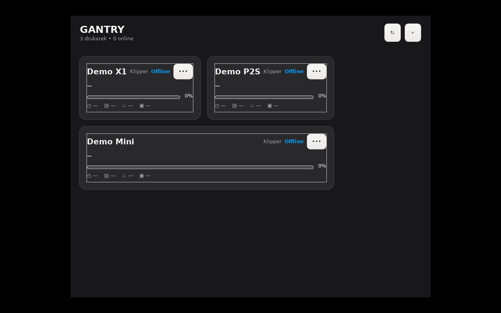

# Gantry for GNU/Linux — beta

The GNU/Linux edition uses GTK 3 and a system tray indicator. It connects locally to Bambu Lab
and Anycubic Kobra S1 over MQTT/TLS, Elegoo Centauri Carbon through SDCP/MQTT LAN, Klipper through Moonraker and Prusa through PrusaLink. Access codes and API keys
are stored in the desktop Secret Service (GNOME Keyring, KWallet with Secret Service support, or
another compatible provider).

The 0.9 dashboard is a direct port of the current macOS code rather than an extension of the old
Linux prototype. It uses the same 380/563 px one/two-column panel, telemetry-driven wide cards,
a single-column ordinary final card, compact list with accordion cards, segmented progress, flat temperature
and filament sections, and an in-panel Details screen with the live camera.

Per-printer menus can open installed native or Flatpak editions of Bambu Studio, OrcaSlicer,
Creality Print and PrusaSlicer. For Bambu printers the Bambu Studio action also provides access
to the camera view.

## Installation packages — in preparation

The Gantry 0.10.0 Linux packages are being prepared and integration-tested. The release workflow
will provide three formats:

- `Gantry-0.10.0-Linux-all.deb` — Ubuntu, Debian, Linux Mint and Pop!_OS
- `Gantry-0.10.0-Linux-noarch.rpm` — Fedora and compatible RPM distributions
- `Gantry-0.10.0-Linux-x86_64.AppImage` — portable x86_64 build with its own Python runtime,
  GTK resources and most application libraries

The `.deb` and `.rpm` packages provide classic system installation. The `.AppImage` is a single,
portable application file containing Gantry and most required libraries. Until these artifacts
appear on GitHub Releases, treat the Linux edition as a beta available from source.

### Ubuntu, Debian, Linux Mint or Pop!_OS

After the package is published, download `Gantry-0.10.0-Linux-all.deb` from GitHub Releases, then run:

```sh
sudo apt install ./Gantry-0.10.0-Linux-all.deb
```

Open **Gantry** from the application menu. The app can be configured to start automatically
after login in **Settings**.

### Fedora or another RPM distribution

```sh
sudo dnf install ./Gantry-0.10.0-Linux-noarch.rpm
```

### Portable AppImage

The AppImage does not require system installation:

```sh
chmod +x Gantry-0.10.0-Linux-x86_64.AppImage
./Gantry-0.10.0-Linux-x86_64.AppImage
```

It bundles the application, Python runtime, GTK resources and most shared libraries. Desktop
services such as the system tray, Secret Service/keyring, notifications and media integration
still use the host desktop where available.



## Add printers

Choose **Add printer** from the tray menu or click `+`, then select **Bambu Lab**, **Elegoo**, **Klipper** or
**Prusa**. For Elegoo, choose **Centauri Carbon** (SDCP 3030, no code) or **Centauri Carbon 2**
(MQTT 1883, access code and LAN-only mode). Both provide an MJPEG camera; CC2 also exposes Canvas
A1–A4. Gantry scans every local network interface using Bambu SSDP announcements and the
MQTT/TLS certificate exposed on port 8883. The add window accepts a VPN/Tailscale IP, range or
CIDR and a custom MQTT port for a TCP/socat tunnel.

Klipper uses the local Moonraker API (port 7125 by default) with an optional API key. Happy Hare
MMU is read through Moonraker and Creality CFS through the printer's local WebSocket. Prusa uses
PrusaLink (port 80 by default) and its API key; no Prusa cloud account is required.

**Import from Bambu Studio** reads `BambuStudio.conf` from the native XDG path and the common
Flatpak paths. Imported access codes are immediately moved into the system Secret Service; they
are not written to Gantry's JSON settings.

Standard Linux and the RPi kiosk also accept bulk CSV. Existing five-column Bambu files remain
compatible; the current template is:

```csv
kind,name,host,serial,access_code,port
bambu,P1S Workshop,192.168.1.21,01P00A123456789,ACCESS_CODE,8883
klipper,Voron,192.168.1.30,,,7125
prusa,MK4,192.168.1.31,,PRUSALINK_API_KEY,80
elegoo_cc1,Centauri Carbon,192.168.1.40,MAINBOARD_ID,,3030
elegoo_cc2,Centauri Carbon 2,192.168.1.41,SERIAL,ACCESS_CODE,1883
```

## Build packages

Debian package (can also be produced on macOS through the portable ar fallback):

```sh
sh linux/scripts/build-deb.sh
```

The package is written to `linux/dist/Gantry-0.10.0-Linux-all.deb`. Set
`GANTRY_PACKAGE_SUFFIX=hotfix` only when producing a separately named hotfix. Core tests do not
require a graphical session.

RPM package (run on Fedora with `rpm-build` and `python3-devel`):

```sh
sh linux/scripts/build-rpm.sh
```

Portable AppImage (run on x86_64 or aarch64 Linux with PyInstaller, linuxdeploy prerequisites,
GTK development files and GObject Introspection development files):

```sh
python3 -m pip install --user pyinstaller
sh linux/scripts/build-appimage.sh
```

The resulting packages are written to `linux/dist/`, which is intentionally ignored by Git.
The GNU/Linux GitHub Actions workflow builds, installs/smoke-tests and uploads all three formats
after a relevant push or pull request. Run the core tests locally with:

```sh
PYTHONPATH=linux python3 -m unittest discover -s linux/tests -v
```

The Linux version is currently beta. KDE users need a Secret Service provider enabled; the
package uses `secret-tool` and will show an error instead of saving an access code in plain text.

Author: **Kamil Grzegorczyk** — [GitHub](https://github.com/parametryczny),
[X](https://x.com/_parametryczny), [support](https://suppi.pl/parametryczny).

## Raspberry Pi workshop kiosk

On 64-bit Raspberry Pi OS with Desktop, install the same architecture-independent `.deb`, then
enable the workshop dashboard for the current desktop user:

```sh
gantry-kiosk-setup
gantry-kiosk
```

The setup command creates an XDG autostart entry and a CSV template in the user's Documents folder. Gantry
starts full-screen after login, prevents idle sleep where the desktop supports it and shows the
pairing address and six-digit code at the bottom of the screen.

Configuration is available in two places:

- click **Konfiguracja** on the connected display to scan, add or edit printers
- open the HTTPS address shown on the display from a phone or computer on the same LAN, accept the
  local certificate on first use, then enter the rotating pairing code

The remote panel shows live printer telemetry (refreshed every 15 seconds) and supports individual
printers and bulk CSV import. Download its template or use:

```csv
kind,name,host,serial,access_code,port
bambu,Drukarka warsztatowa,192.168.1.50,NUMER_SERYJNY,KOD_DOSTEPU,8883
```

The CSV contains printer access codes. Remove it after a successful import. Codes are moved into
the desktop Secret Service and are not copied to Gantry's JSON settings. SSH is only needed for
system updates and diagnostics.

Disable kiosk autostart with:

```sh
gantry-kiosk-setup --disable
```
